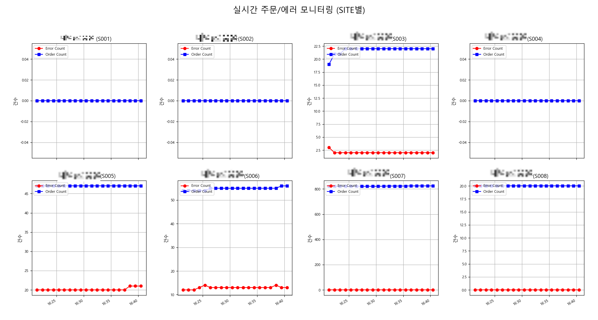

# python
파이썬 개별 파일들

## foresttrip.py
* 경기도권 자연휴양림 자리를 찾아 슬랙으로 해당일자와 예약가능한 숫자를 전송한다.

## getTumblrVideo.py
* 텀플러 동영상 크롤링

## naverwebtoon.py
* 네이버 웹툰을 다운받아서 이미지를 합치고 압축, 텔레그램 전송

## jenkins_changelog.py
* jenkins 빌드 내용을 HTML 파일로 생성하여 빌드일자별 COMMIT내용, 변경파일 목록등을 HTML파일로 생성한다.

## ordercountmonitor.py
* 1분에 한번씩 특정 쿼리를 실행해서 그래프에 값을 표현
  
